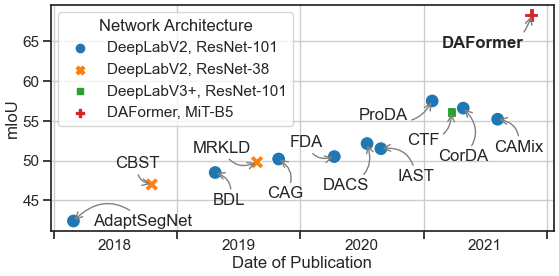

## DAFormer: Improving Network Architectures and Training Strategies for Domain-Adaptive Semantic Segmentation

**by [Lukas Hoyer](https://lhoyer.github.io/), [Dengxin Dai](https://vas.mpi-inf.mpg.de/dengxin/), and [Luc Van Gool](https://scholar.google.de/citations?user=TwMib_QAAAAJ&hl=en)**

**[[Arxiv]](https://arxiv.org/abs/2111.14887)**
**[[Paper]](https://arxiv.org/pdf/2111.14887.pdf)**

:bell: We are happy to announce that DAFormer was accepted at **CVPR22**. :bell:

:bell: We are happy to announce that our follow-up work [HRDA](https://github.com/lhoyer/HRDA) on high-resolution UDA was accepted at **ECCV22**. :bell:

## Overview

As acquiring pixel-wise annotations of real-world images for semantic
segmentation is a costly process, a model can instead be trained with more
accessible synthetic data and adapted to real images without requiring their
annotations. This process is studied in **Unsupervised Domain Adaptation (UDA)**.

Even though a large number of methods propose new UDA strategies, they
are mostly based on outdated network architectures. In this work, we
particularly study the influence of the network architecture on UDA performance
and propose **DAFormer**, a network architecture tailored for UDA. It consists of a
Transformer encoder and a multi-level context-aware feature fusion decoder.

DAFormer is enabled by three simple but crucial training strategies to stabilize the
training and to avoid overfitting the source domain: While the
**Rare Class Sampling** on the source domain improves the quality of pseudo-labels
by mitigating the confirmation bias of self-training towards common classes,
the **Thing-Class ImageNet Feature Distance** and a **Learning Rate Warmup** promote
feature transfer from ImageNet pretraining.

DAFormer significantly improves
the state-of-the-art performance **by 10.8 mIoU for GTA→Cityscapes**
and **by 5.4 mIoU for Synthia→Cityscapes** and enables learning even
difficult classes such as train, bus, and truck well.



The strengths of DAFormer, compared to the previous state-of-the-art UDA method
ProDA, can also be observed in qualitative examples from the Cityscapes
validation set.


For more information on DAFormer, please check our
[[Paper]](https://arxiv.org/pdf/2111.14887.pdf).

If you find this project useful in your research, please consider citing:

```
@InProceedings{hoyer2022daformer,
  title={{DAFormer}: Improving Network Architectures and Training Strategies for Domain-Adaptive Semantic Segmentation},
  author={Hoyer, Lukas and Dai, Dengxin and Van Gool, Luc},
  booktitle={Proceedings of the IEEE/CVF Conference on Computer Vision and Pattern Recognition (CVPR)},
  pages={9924--9935},
  year={2022}
}
```

## Comparison with State of the Art

DAFormer significantly outperforms previous works on several UDA benchmarks.
This includes synthetic-to-real adaptation on GTA→Cityscapes and
Synthia→Cityscapes as well as clear-to-adverse-weather adaptation on
Cityscapes→ACDC and Cityscapes→DarkZurich.

|                     | GTA→CS(val)    | Synthia→CS(val)    | CS→ACDC(test)   | CS→DarkZurich(test)   |
|---------------------|----------------|--------------------|-----------------|-----------------------|
| ADVENT [1]          | 45.5           | 41.2               | 32.7            | 29.7                  |
| BDL [2]             | 48.5           | --                 | 37.7            | 30.8                  |
| FDA [3]             | 50.5           | --                 | 45.7            | --                    |
| DACS [4]            | 52.1           | 48.3               | --              | --                    |
| ProDA [5]           | 57.5           | 55.5               | --              | --                    |
| MGCDA [6]           | --             | --                 | 48.7            | 42.5                  |
| DANNet [7]          | --             | --                 | 50.0            | 45.2                  |
| **DAFormer (Ours)** | **68.3**       | **60.9**           | **55.4***       | **53.8***             |

&ast; New results obtained after CVPR'22 publication of DAFormer

References:

1. Vu et al. "Advent: Adversarial entropy minimization for domain adaptation in semantic segmentation" in CVPR 2019.
2. Li et al. "Bidirectional learning for domain adaptation of semantic segmentation" in CVPR 2019.
3. Yang et al. "Fda: Fourier domain adaptation for semantic segmentation" in CVPR 2020.
4. Tranheden et al. "Dacs: Domain adaptation via crossdomain mixed sampling" in WACV 2021.
5. Zhang et al. "Prototypical pseudo label denoising and target structure learning for domain adaptive semantic segmentation" in CVPR 2021.
6. Sakaridis et al. "Map-guided curriculum domain adaptation and uncertaintyaware evaluation for semantic nighttime image segmentation" in TPAMI, 2020.
7. Wu et al. "DANNet: A one-stage domain adaptation network for unsupervised nighttime semantic segmentation" in CVPR, 2021.

## Setup Environment

For this project, we used python 3.8.5. We recommend setting up a new virtual
environment:

```shell
python -m venv ~/venv/daformer
source ~/venv/daformer/bin/activate
```

In that environment, the requirements can be installed with:

```shell
pip install -r requirements.txt -f https://download.pytorch.org/whl/torch_stable.html
pip install mmcv-full==1.3.7  # requires the other packages to be installed first
```

Further, please download the MiT weights and a pretrained DAFormer using the
following script. If problems occur with the automatic download, please follow
the instructions for a manual download within the script.

```shell
sh tools/download_checkpoints.sh
```

All experiments were executed on a NVIDIA RTX 2080 Ti.

## Inference Demo

Already as this point, the provided DAFormer model (downloaded by
`tools/download_checkpoints.sh`) can be applied to a demo image:

```shell
python -m demo.image_demo demo/demo.png work_dirs/211108_1622_gta2cs_daformer_s0_7f24c/211108_1622_gta2cs_daformer_s0_7f24c.json work_dirs/211108_1622_gta2cs_daformer_s0_7f24c/latest.pth
```

When judging the predictions, please keep in mind that DAFormer had no access
to real-world labels during the training.

## Setup Datasets

**Cityscapes:** Please, download leftImg8bit_trainvaltest.zip and
gt_trainvaltest.zip from [here](https://www.cityscapes-dataset.com/downloads/)
and extract them to `data/cityscapes`.

**GTA:** Please, download all image and label packages from
[here](https://download.visinf.tu-darmstadt.de/data/from_games/) and extract
them to `data/gta`.

**Synthia (Optional):** Please, download SYNTHIA-RAND-CITYSCAPES from
[here](http://synthia-dataset.net/downloads/) and extract it to `data/synthia`.

**ACDC (Optional):** Please, download rgb_anon_trainvaltest.zip and
gt_trainval.zip from [here](https://acdc.vision.ee.ethz.ch/download) and
extract them to `data/acdc`. Further, please restructure the folders from
`condition/split/sequence/` to `split/` using the following commands:

```shell
rsync -a data/acdc/rgb_anon/*/train/*/* data/acdc/rgb_anon/train/
rsync -a data/acdc/rgb_anon/*/val/*/* data/acdc/rgb_anon/val/
rsync -a data/acdc/gt/*/train/*/*_labelTrainIds.png data/acdc/gt/train/
rsync -a data/acdc/gt/*/val/*/*_labelTrainIds.png data/acdc/gt/val/
```

**Dark Zurich (Optional):** Please, download the Dark_Zurich_train_anon.zip
and Dark_Zurich_val_anon.zip from
[here](https://www.trace.ethz.ch/publications/2019/GCMA_UIoU/) and extract it
to `data/dark_zurich`.

The final folder structure should look like this:

```none
DAFormer
├── ...
├── data
│   ├── acdc (optional)
│   │   ├── gt
│   │   │   ├── train
│   │   │   ├── val
│   │   ├── rgb_anon
│   │   │   ├── train
│   │   │   ├── val
│   ├── cityscapes
│   │   ├── leftImg8bit
│   │   │   ├── train
│   │   │   ├── val
│   │   ├── gtFine
│   │   │   ├── train
│   │   │   ├── val
│   ├── dark_zurich (optional)
│   │   ├── gt
│   │   │   ├── val
│   │   ├── rgb_anon
│   │   │   ├── train
│   │   │   ├── val
│   ├── gta
│   │   ├── images
│   │   ├── labels
│   ├── synthia (optional)
│   │   ├── RGB
│   │   ├── GT
│   │   │   ├── LABELS
├── ...
```

**Data Preprocessing:** Finally, please run the following scripts to convert the label IDs to the
train IDs and to generate the class index for RCS:

```shell
python tools/convert_datasets/gta.py data/gta --nproc 8
python tools/convert_datasets/cityscapes.py data/cityscapes --nproc 8
python tools/convert_datasets/synthia.py data/synthia/ --nproc 8
```

## Training

For convenience, we provide an [annotated config file](configs/daformer/gta2cs_uda_warm_fdthings_rcs_croppl_a999_daformer_mitb5_s0.py) of the final DAFormer.
A training job can be launched using:

```shell
python run_experiments.py --config configs/daformer/gta2cs_uda_warm_fdthings_rcs_croppl_a999_daformer_mitb5_s0.py
```

For the experiments in our paper (e.g. network architecture comparison,
component ablations, ...), we use a system to automatically generate
and train the configs:

```shell
python run_experiments.py --exp <ID>
```

More information about the available experiments and their assigned IDs, can be
found in [experiments.py](experiments.py). The generated configs will be stored
in `configs/generated/`.

## Testing & Predictions

The provided DAFormer checkpoint trained on GTA→Cityscapes
(already downloaded by `tools/download_checkpoints.sh`) can be tested on the
Cityscapes validation set using:

```shell
sh test.sh work_dirs/211108_1622_gta2cs_daformer_s0_7f24c
```

The predictions are saved for inspection to
`work_dirs/211108_1622_gta2cs_daformer_s0_7f24c/preds`
and the mIoU of the model is printed to the console. The provided checkpoint
should achieve 68.85 mIoU. Refer to the end of
`work_dirs/211108_1622_gta2cs_daformer_s0_7f24c/20211108_164105.log` for
more information such as the class-wise IoU.

Similarly, also other models can be tested after the training has finished:

```shell
sh test.sh path/to/checkpoint_directory
```

When evaluating a model trained on Synthia→Cityscapes, please note that the
evaluation script calculates the mIoU for all 19 Cityscapes classes. However,
Synthia contains only labels for 16 of these classes. Therefore, it is a common
practice in UDA to report the mIoU for Synthia→Cityscapes only on these 16
classes. As the Iou for the 3 missing classes is 0, you can do the conversion
mIoU16 = mIoU19 * 19 / 16.

The results for Cityscapes→ACDC and Cityscapes→DarkZurich are reported on
the test split of the target dataset. To generate the predictions for the test
set, please run:

```shell
python -m tools.test path/to/config_file path/to/checkpoint_file --test-set --format-only --eval-option imgfile_prefix=labelTrainIds to_label_id=False
```

The predictions can be submitted to the public evaluation server of the
respective dataset to obtain the test score.

## Checkpoints

Below, we provide checkpoints of DAFormer for different benchmarks.
As the results in the paper are provided as the mean over three random
seeds, we provide the checkpoint with the median validation performance here.

* [DAFormer for GTA→Cityscapes](https://drive.google.com/file/d/1pG3kDClZDGwp1vSTEXmTchkGHmnLQNdP/view?usp=sharing)
* [DAFormer for Synthia→Cityscapes](https://drive.google.com/file/d/1V9EpoTePjGq33B8MfombxEEcq9a2rBEt/view?usp=sharing)
* [DAFormer for Cityscapes→ACDC](https://drive.google.com/file/d/16RSBkzJbGprWr04LjyNleqRzRZgCaEBn/view?usp=sharing)
* [DAFormer for Cityscapes→DarkZurich](https://drive.google.com/file/d/1_VXKDhnp4x4sslBj5B8tqqBJXeOuI9hS/view?usp=sharing)

The checkpoints come with the training logs. Please note that:

* The logs provide the mIoU for 19 classes. For Synthia→Cityscapes, it is
  necessary to convert the mIoU to the 16 valid classes. Please, read the
  section above for converting the mIoU.
* The logs provide the mIoU on the validation set. For Cityscapes→ACDC and
  Cityscapes→DarkZurich the results reported in the paper are calculated on the
  test split. For DarkZurich, the performance significantly differs between
  validation and test split. Please, read the section above on how to obtain
  the test mIoU.

## Framework Structure

This project is based on [mmsegmentation version 0.16.0](https://github.com/open-mmlab/mmsegmentation/tree/v0.16.0).
For more information about the framework structure and the config system,
please refer to the [mmsegmentation documentation](https://mmsegmentation.readthedocs.io/en/latest/index.html)
and the [mmcv documentation](https://mmcv.readthedocs.ihttps://arxiv.org/abs/2007.08702o/en/v1.3.7/index.html).

The most relevant files for DAFormer are:

* [configs/daformer/gta2cs_uda_warm_fdthings_rcs_croppl_a999_daformer_mitb5_s0.py](configs/daformer/gta2cs_uda_warm_fdthings_rcs_croppl_a999_daformer_mitb5_s0.py):
  Annotated config file for the final DAFormer.
* [mmseg/models/uda/dacs.py](mmseg/models/uda/dacs.py):
  Implementation of UDA self-training with ImageNet Feature Distance.
* [mmseg/datasets/uda_dataset.py](mmseg/datasets/uda_dataset.py):
  Data loader for UDA with Rare Class Sampling.
* [mmseg/models/decode_heads/daformer_head.py](mmseg/models/decode_heads/daformer_head.py):
  Implementation of DAFormer decoder with context-aware feature fusion.
* [mmseg/models/backbones/mix_transformer.py](mmseg/models/backbones/mix_transformer.py):
  Implementation of Mix Transformer encoder (MiT).

## Acknowledgements

This project is based on the following open-source projects. We thank their
authors for making the source code publically available.

* [MMSegmentation](https://github.com/open-mmlab/mmsegmentation)
* [SegFormer](https://github.com/NVlabs/SegFormer)
* [DACS](https://github.com/vikolss/DACS)

## License

This project is released under the [Apache License 2.0](LICENSE), while some 
specific features in this repository are with other licenses. Please refer to 
[LICENSES.md](LICENSES.md) for the careful check, if you are using our code for 
commercial matters.
